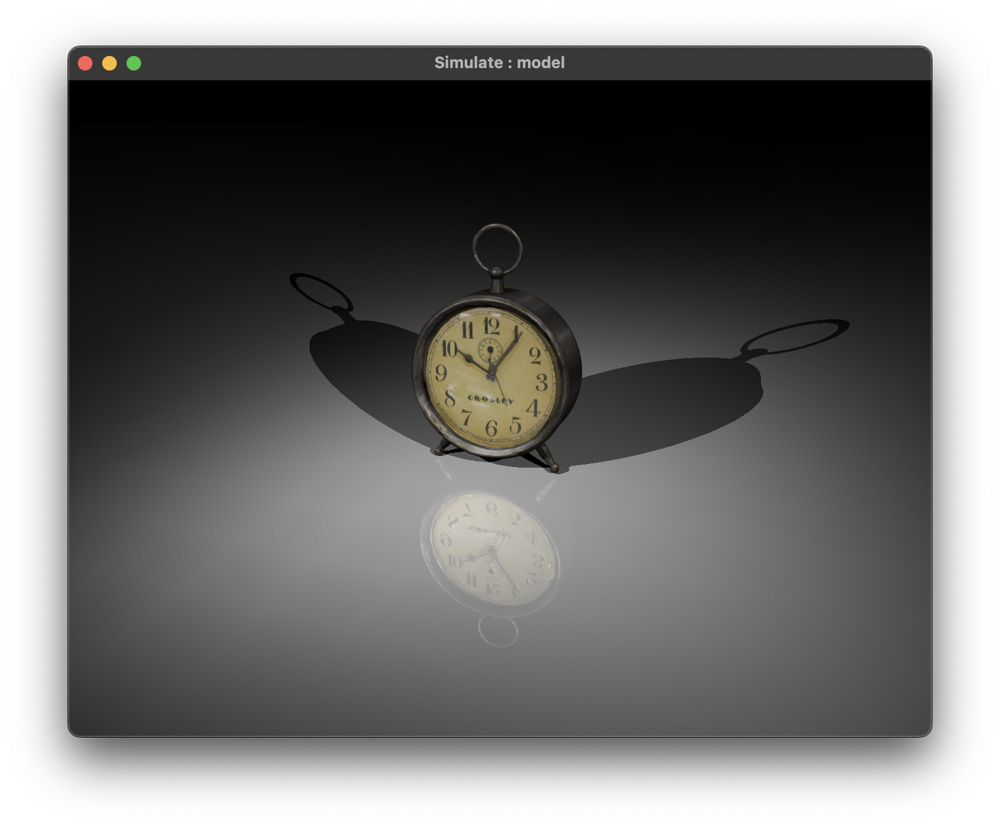
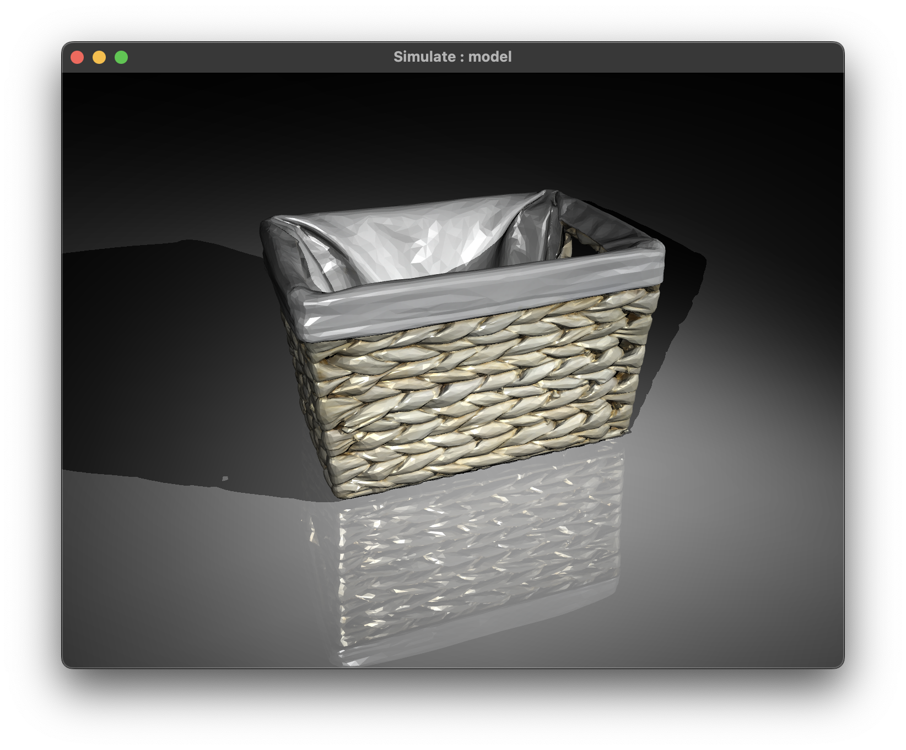
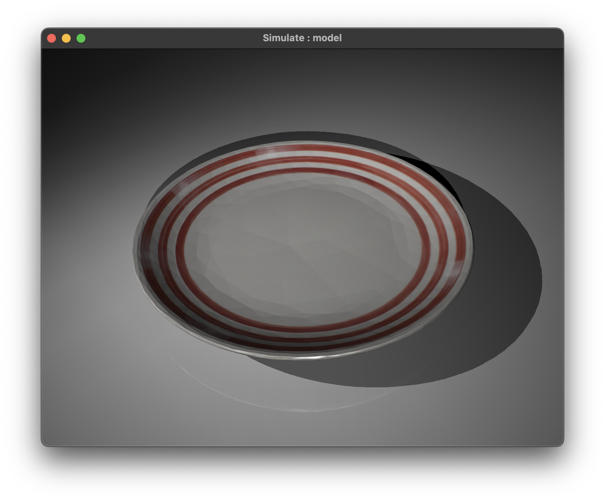
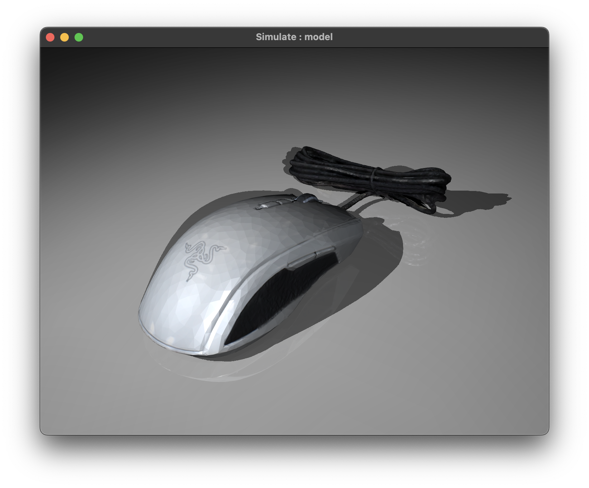
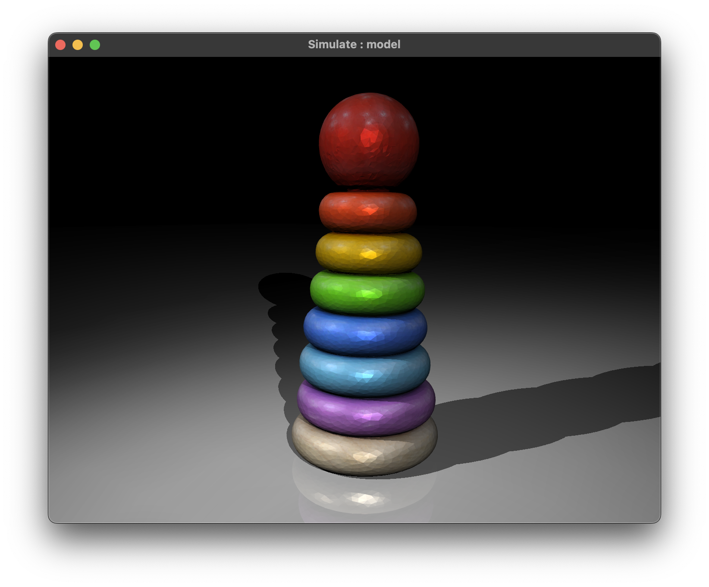
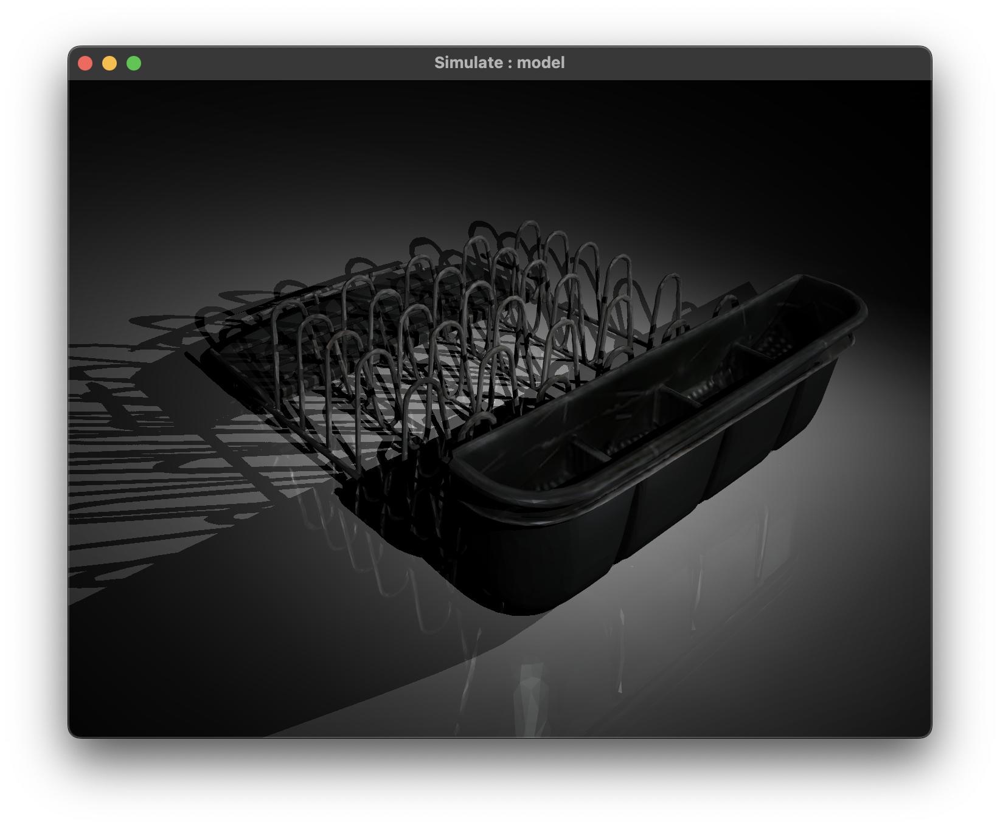
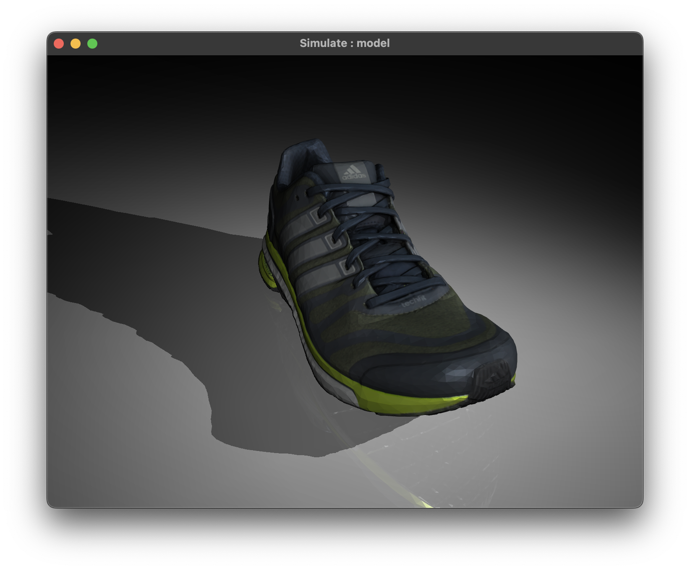
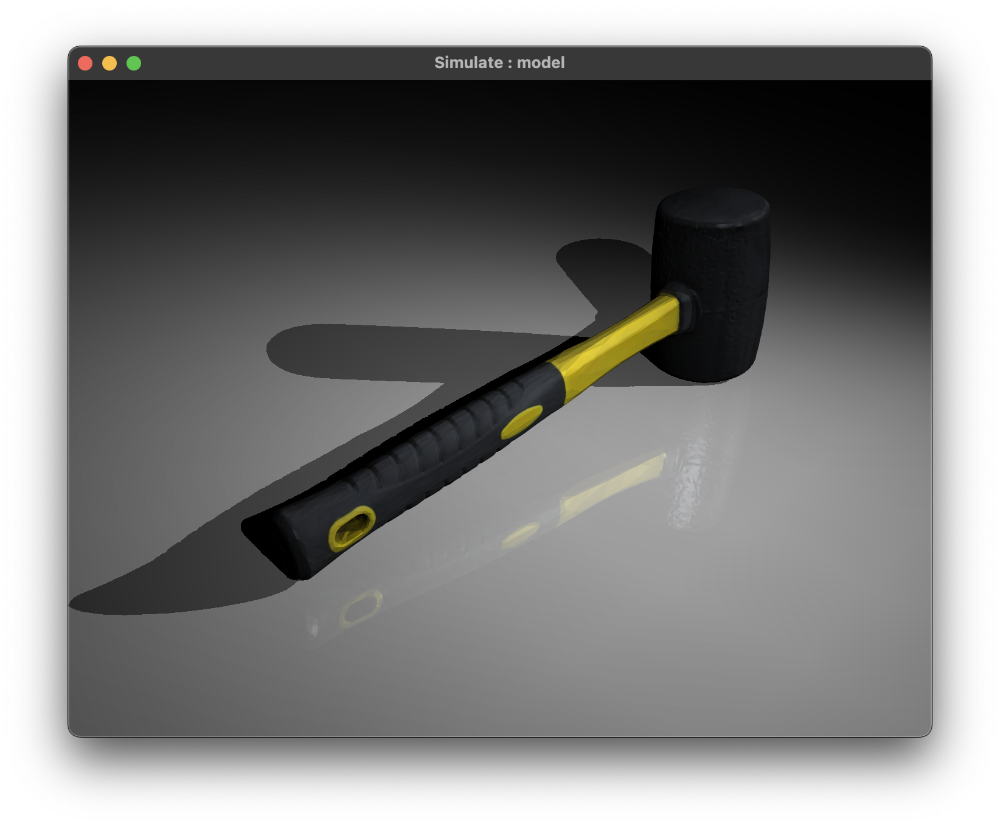

# Scanned Objects MuJoCo Models

This repository contains [MuJoCo](https://mujoco.org/) MJCF models for all 1030 household objects in Google's [Scanned Objects Dataset](https://ai.googleblog.com/2022/06/scanned-objects-by-google-research.html). The XML files were automatically generated using [obj2mjcf](https://github.com/kevinzakka/obj2mjcf). A sample of the models is shown below:

<p float="left">
  
  
  
  
  
  
  
  
</p>

## Structure

In each object directory, you'll find the following:

```bash
model.obj
model_collision_*.obj  # 32 collision submeshes.
texture.png
model.xml
```

The model definition lives in `model.xml`. To visualize it, you can drag-and-drop it in the simulate binary. You can examine the visual and collision meshes by cycling between groups 2 and 3. The collision mesh is a convex approximation that has been generated with [V-HACD](https://github.com/kmammou/v-hacd).

If there are any problems loading a particular model in MuJoCo, please raise an issue on the [GitHub repository](https://github.com/kevinzakka/mujoco_scanned_objects).

## License

The 3D assets (obj and png) are licensed under the [CC-BY 4.0 License](https://creativecommons.org/licenses/by/4.0/). The MJCF (XML) files are licensed under the [MIT License](LICENSE).

## Citation

If you use these models in your research, consider citing the original paper:

```bibtex
@misc{downs2022scannedobjects,
    url = {https://arxiv.org/abs/2204.11918},
    author = {Downs, Laura and Francis, Anthony and Koenig, Nate and Kinman, Brandon and Hickman, Ryan and Reymann, Krista and McHugh, Thomas B. and Vanhoucke, Vincent},
    keywords = {Robotics (cs.RO), Graphics (cs.GR), FOS: Computer and information sciences, FOS: Computer and information sciences},
    title = {Google Scanned Objects: A High-Quality Dataset of 3D Scanned Household Items},
    publisher = {arXiv},
    year = {2022},
}
```

If you're feeling generous, you can also cite this repository:

```bibtex
@software{zakka2022scannedobjectsmujoco,
    author = {Zakka, Kevin},
    month = {7},
    title = {{Scanned Objects MuJoCo Models}},
    url = {https://github.com/kevinzakka/mujoco_scanned_objects},
    version = {0.0.1},
    year = {2022}
}
```

_Disclaimer: This is not affiliated with Scanned Objects or Google Research._
