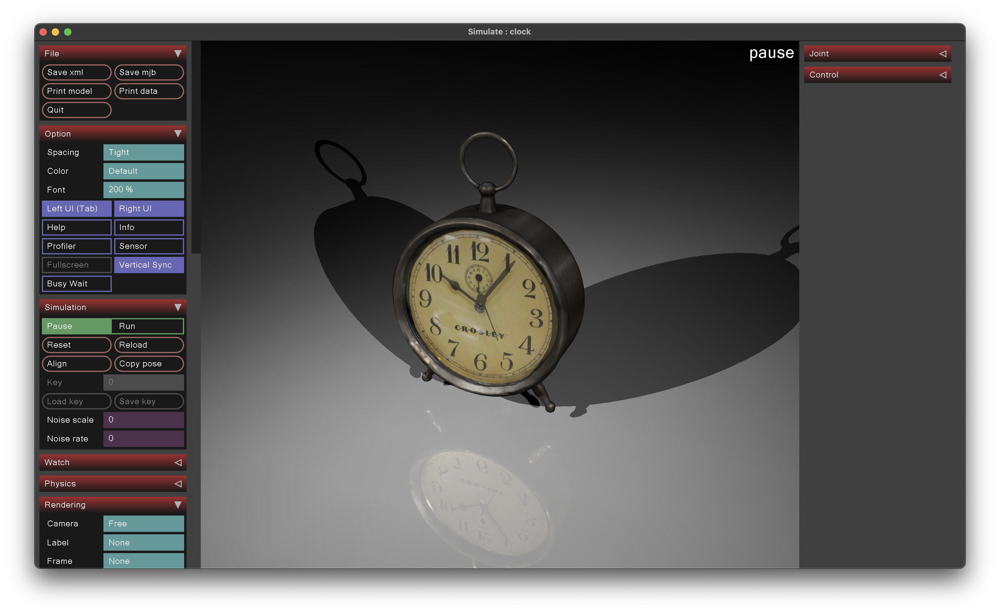

# Scanned Objects MuJoCo Models

_Disclaimer: This is not an official Google product._

This repository contains models of all 1030 [Scanned Objects](https://ai.googleblog.com/2022/06/scanned-objects-by-google-research.html) in the form of MJCF files that can be loaded and simulated in the [MuJoCo](https://mujoco.org/) physics engine. All MuJoCo models were automatically generated with [obj2mjcf](https://github.com/kevinzakka/obj2mjcf).

Here is what the [Vintage Alarm Clock](https://app.gazebosim.org/GoogleResearch/fuel/models/Crosley_Alarm_Clock_Vintage_Metal) looks like in MuJoCo:



## Structure

In each model directory, you'll find the following:

```bash
model.obj
model_collision_*.obj  # 32 collision submeshes.
texture.png
model.xml
```

The model definition lives in `model.xml`. To visualize it, you can drag-and-drop it in the simulate binary. You can examine the visual and collision meshes by cycling between groups 2 and 3. The collision mesh is a convex approximation that is generated with [V-HACD](https://github.com/kmammou/v-hacd). Note that we downsampled the texture to 25% of its original resolution.

If there are any problems loading the models in MuJoCo, please raise an issue on the [GitHub repository](https://github.com/kevinzakka/mujoco_scanned_objects).

## License

The 3D assets and textures are licensed under the [CC-BY 4.0 License](https://creativecommons.org/licenses/by/4.0/). The MJCF (XML) files are licensed under the [MIT License](LICENSE).
